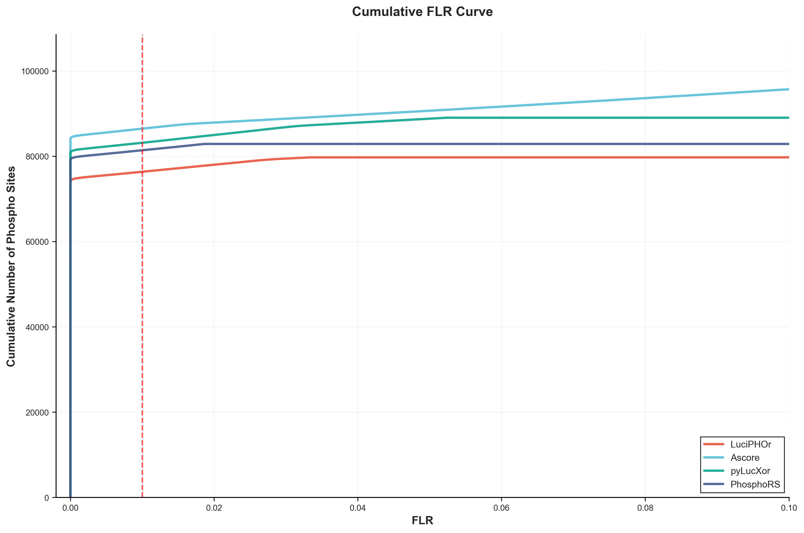
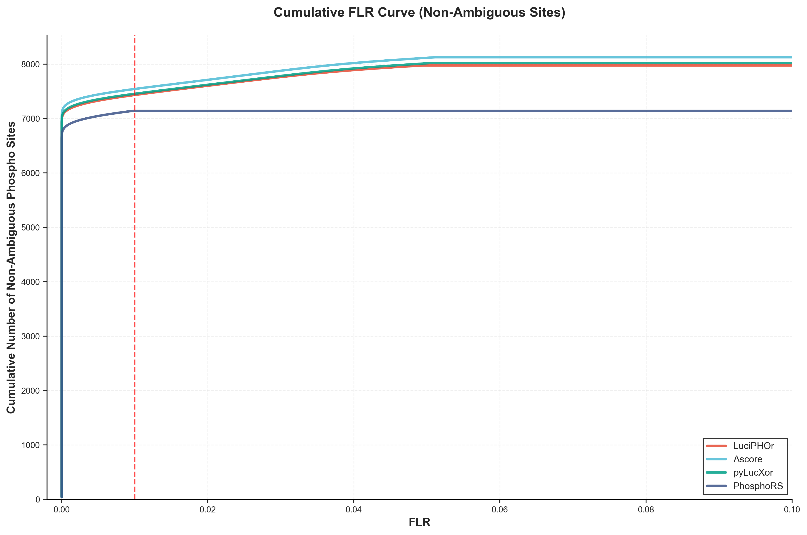

# Benchmark Results: PXD000138 Dataset

## Overview

This document presents the benchmark results of four phosphorylation site localization tools (LuciPHOr, Ascore, pyLucXor, and PhosphoRS) on the PXD000138 dataset. All tools were tested using identical input files (mzML and idXML) to ensure fair comparison.

## Methodology

### Data Processing Pipeline

1. **Initial Processing**: LuciPHOr results were obtained using quantms workflow on PXD000138 dataset
2. **Comparative Testing**: Ascore, pyLucXor, and PhosphoRS were tested using the same mzML and idXML files as LuciPHOr
3. **Quality Filtering** (applied first to all PSMs):
   - **LuciPHOr & pyLucXor**: local_flr < 0.01
   - **Ascore**: Ascore_site > 20
   - **PhosphoRS**: site_prob > 99%
   - **All tools**: FDR < 0.01
4. **Post-filtering**: Removed peptides with ambiguous sites and decoy peptides
5. **Site Counting**: After filtering, phosphorylation sites (Phospho and PhosphoDecoy) were counted from the remaining high-quality PSMs
6. **Validation**: Matched filtered results from each tool against the ground truth/reference dataset to calculate True Positives (TP) and False Positives (FP)

### Quality Filtering Thresholds

The following thresholds were applied to ensure high-quality phosphorylation site localization:

| Tool | Metric | Recommended Threshold | Description |
|------|--------|----------------------|-------------|
| **LuciPHOr** | local_flr | < 0.01 | Local False Localization Rate per charge state |
| **AScore** | AScore_site | > 20 | Site-specific AScore |
| **pyLucXor** | local_flr | < 0.01 | Local FLR per charge state |
| **PhosphoRS** | site_prob | > 99% | Site probability percentage |

**Note**: All tools also require **FDR < 0.01** as a baseline quality filter.

### pAla Strategy

**pAla** refers to phosphorylated Alanine (pAla), which serves as a decoy modification for FLR (False Localization Rate) estimation. Since Alanine cannot be phosphorylated in biological systems, any assignment of phosphorylation to Alanine residues represents a false localization event. This target-decoy approach enables statistical estimation of localization errors:

- **Phospho**: True phosphorylation sites on S/T/Y residues (target)
- **PhosphoDecoy**: Phosphorylation incorrectly assigned to Alanine (decoy/pAla)

### Uncertainty Classification

Uncertain phosphorylation sites were identified using criteria from the respective original papers:

- **Ascore**: Ascore_site < 3
- **LuciPHOr & pyLucXor**: Luciphor_delta_score < 3
- **PhosphoRS**: site_prob < 75%

## Results

**Note**: All site counts below are obtained from PSMs that passed the quality filtering criteria described in the Methodology section.

### Table 1: Well-Resolved Phosphorylation Sites

| Tool | Phospho_Count | PhosphoDecoy_Count | Total_Sites |
|------|---------------|-------------------|-------------|
| **LuciPHOr** | 48186 | 1168 | 49354 |
| **Ascore** | 52906 | 1541 | 54447 |
| **pyLucXor** | 51468 | 1616 | 53084 |
| **PhosphoRS** | 50000 | 722 | 50722 |

*Counts represent phosphorylation sites from filtered, high-quality PSMs only.*

### Table 2: Uncertain Phosphorylation Sites

| Tool | Phospho_Count | PhosphoDecoy_Count | Total_Sites | Percentage_of_Total_PSMs |
|------|---------------|--------------------|-------------|--------------------------|
| **LuciPHOr** | 37337 | 5670 | 43007 | 9.977655 |
| **Ascore** | 23628 | 16921 | 40549 | 10.52425 |
| **pyLucXor** | 38970 | 6511 | 45481 | 10.74325 |
| **PhosphoRS** | 26354 | 4168 | 30522 | 6.614142 |

*Counts represent phosphorylation sites from filtered PSMs that meet quality thresholds but have uncertain localization.*

### Table 3: Site Localization Quality

| Tool | Total_PSMs | Total_Phospho_Sites | Well_Resolved_Phospho_Sites | Uncertain_Phospho_Sites |
|------|------------|---------------------|----------------------------|------------------------|
| **LuciPHOr** | 111588 | 118625 | 48186 | 37337 |
| **Ascore** | 111747 | 101382 | 52906 | 23628 |
| **pyLucXor** | 111588 | 117341 | 51468 | 38970 |
| **PhosphoRS** | 111747 | 107552 | 50000 | 26354 |

*Total_PSMs: Number of PSMs after quality filtering. Total_Phospho_Sites: Sum of all phosphorylation sites from filtered PSMs.*

### Figure 1: FLR-Controlled Cumulative Phosphorylation Sites

The cumulative FLR (False Localization Rate) curve shows the number of identified phosphorylation sites as a function of the FLR threshold. **This analysis does not apply algorithm-specific filtering thresholds** (such as local_flr, Ascore, or site_prob), instead using only the unified pAla-based FLR control to enable fair cross-tool comparison. The analysis includes both well-resolved and ambiguous sites, providing a comprehensive view of tool performance across different FLR thresholds.

#### Table 4: Phosphorylation Sites at Standard FLR Thresholds

| Tool | Phospho Sites at 1% FLR | Phospho Sites at 5% FLR |
|------|------------------------|------------------------|
| **LuciPHOr** | 75,626 | 77,101 |
| **Ascore** | 85,626 | 86,167 |
| **pyLucXor** | 82,349 | 84,397 |
| **PhosphoRS** | 80,618 | 81,473 |

*At the recommended 1% FLR threshold, Ascore identifies the most phosphorylation sites (85,626), followed by pyLucXor (82,349), PhosphoRS (80,618), and LuciPHOr (75,626).*

### Figure 2: FLR Curve for Non-Ambiguous Sites

This curve shows the FLR (False Localization Rate) performance when considering only non-ambiguous phosphorylation sites (where the number of potential sites equals the number of phosphorylation modifications). **Like Figure 1, this analysis does not apply algorithm-specific filtering**, relying solely on the pAla-based FLR threshold for unbiased comparison. This provides insight into tool performance on the most confident site assignments.

## Analysis

### Global False Localization Rate (FLR)

PhosphoRS achieved the lowest Global FLR (0.0142), followed by LuciPHOr (0.0237), Ascore (0.0283), and pyLucXor (0.0304). This indicates PhosphoRS has the highest precision in phosphorylation site localization under the applied filtering criteria.

### Well-Resolved Sites

- **Ascore** identified the highest number of well-resolved phosphorylation sites (52,906)
- **pyLucXor** identified 51,468 well-resolved sites
- **PhosphoRS** identified 50,000 well-resolved sites
- **LuciPHOr** identified 48,186 well-resolved sites

### Uncertain Sites

- **pyLucXor** had the highest number of uncertain sites (38,970)
- **LuciPHOr** had 37,337 uncertain sites
- **PhosphoRS** had 26,354 uncertain sites
- **Ascore** had the lowest number of uncertain sites (23,628)

### Trade-offs

The results demonstrate a trade-off between sensitivity and specificity:

- **PhosphoRS**: Best precision (lowest FLR) but moderate sensitivity
- **Ascore**: Highest number of well-resolved sites with moderate FLR and lowest uncertainty
- **pyLucXor**: High sensitivity but highest FLR and uncertainty
- **LuciPHOr**: Balanced performance with good precision and moderate sensitivity

## Conclusions

Each tool demonstrates distinct strengths:

1. **PhosphoRS** is recommended when precision is critical (lowest FLR: 1.42%)
2. **Ascore** provides the best balance with highest well-resolved sites and lowest uncertainty
3. **pyLucXor** offers high sensitivity but requires careful FLR consideration
4. **LuciPHOr** provides reliable balanced performance suitable for general applications

The choice of tool should be guided by the specific requirements of the analysis, weighing the importance of precision versus sensitivity in phosphorylation site localization.

## Dataset Information

- **Dataset**: PXD000138
- **Input Files**: mzML and idXML files
- **Validation**: Ground truth results

## References

- Filtering criteria and uncertainty thresholds are based on the original publications of each respective tool
- All tools were evaluated under identical conditions to ensure fair comparison

